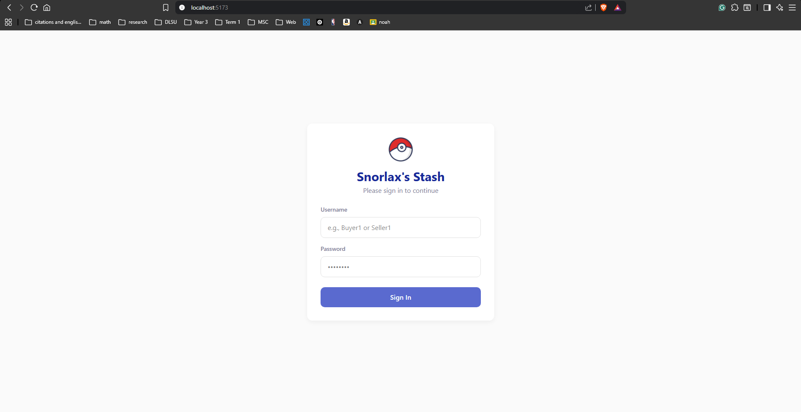
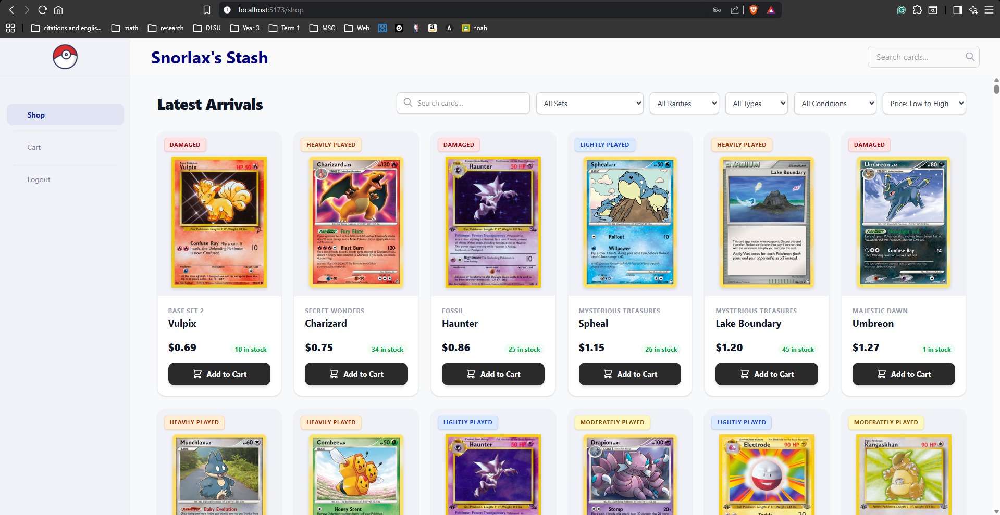
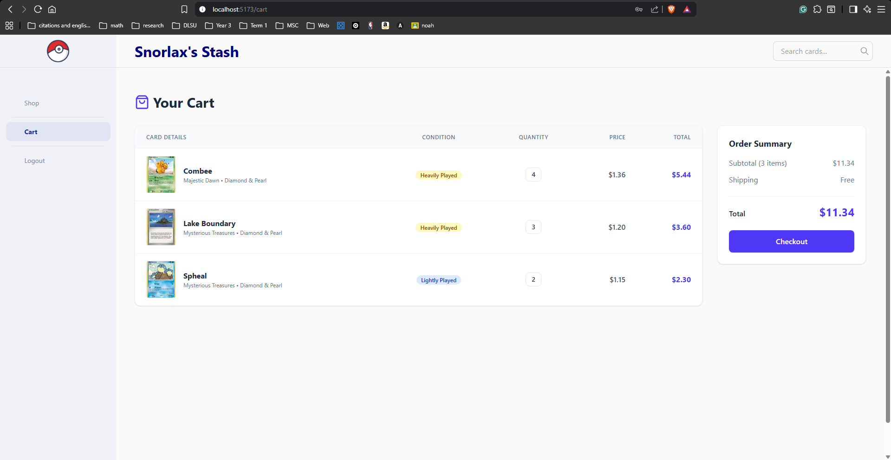
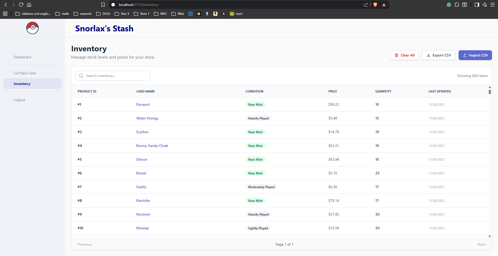
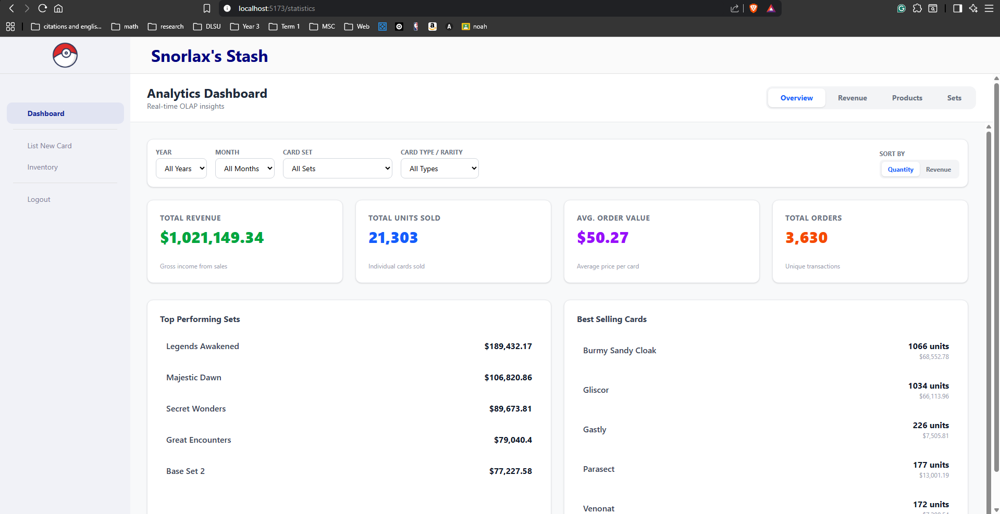

# Pokemon Trading Card E-Commerce System
* MCO2 Folder

## Overview

This project is a full-stack web application designed to demonstrate high-concurrency database operations, advanced replication strategies (Physical & Logical), and Data Warehousing (OLAP). It features a "Trading Card" store where users can browse cards, manage carts, and checkout, while a separate background system generates analytical reports.

The entire system is containerized and orchestrated via Docker Compose.

-----

## 🚀 Web App Features

The application simulates a high-traffic e-commerce platform with the following core features:

### 1. Transactional Store (OLTP)

  * **Product Browsing & Cart Management:** Users can add items to their cart. The system uses an optimized "Upsert" strategy to efficiently handle concurrent cart updates.
  * **Safe Checkout:** A robust checkout process handles the complex logic of moving items from Cart to Order. It utilizes a **Stored Procedure** (`checkout_cart`) to ensure ACID compliance.
  * **Inventory Management:** Strict database constraints (`CHECK quantity >= 0`) prevent overselling, even during "Flash Sale" race conditions.
  








### 2. Analytical Reporting (OLAP)

  * **Automated Data Warehousing:** Sales data is automatically synced to a separate OLAP database for reporting.
  * **Real-time Transformation:** Instead of nightly batch jobs, triggers transform raw operational data into a Star Schema in real-time.



-----

## 🏛 Database Schema (OLTP & OLAP)

The system employs a dual-database architecture to separate concerns.

### 1. OLTP Schema (Transactional)

**File:** `create_oltp_schema.sql`

  * **Design:** Normalized (3NF) to reduce redundancy and ensure data integrity.
  * **Deadlock Avoidance:** The `checkout_cart` procedure enforces **Deterministic Ordering** (sorting locks by `product_id ASC`) to prevent circular wait deadlocks during concurrent checkouts.
  * **Key Tables:**
      * `Product`, `Card`, `Set`: Hierarchical data structure.
      * `Inventory`: Separated from Product to allow granular locking.
      * `Cart`, `Cart_Item`: Manages user sessions.
      * `Customer`: Signed-in customers who use the app.
      * `Order`, `orderitem`: Stores the checked-out items of customers. 

### 2. OLAP Schema (Analytical)

**File:** `create_olap_schema.sql`

  * **Design:** Star Schema optimized for read-heavy aggregations.
  * **Fact Table:** `fact_sales` (Central table linking to dimensions).
  * **Dimension Tables:** `dim_product`, `dim_customer`, `dim_date` (Denormalized for simple reporting queries).
  * **Sync Mechanism:** Uses PostgreSQL **Logical Replication** (`olap_sub`) combined with "Forward" and "Backfill" triggers to populate the data warehouse immediately upon sale.

-----

## 🔄 Replication and Backup

The architecture implements two distinct types of replication:

### 1. Hot Backup (Physical Replication)

  * **Purpose:** High Availability (HA) and Disaster Recovery for the OLTP database.
  * **Mechanism:** The `db_hot` service streams Write-Ahead Logs (WAL) directly from the primary `db` using `pg_basebackup` and streaming replication.
  * **Automatic Failover:** A `failover_watcher_oltp` service monitors the primary. If the primary goes down, it runs `pg_ctl promote` on the standby to promote it to the new primary.

### 2. Reporting Replica (Logical Replication)

  * **Purpose:** Offloading analytical queries to a dedicated Data Warehouse.
  * **Mechanism:** The OLTP database defines a publication `olap_source_pub` containing only relevant tables (`Order`, `Product`, etc.). The OLAP database subscribes to this via `olap_sub`, receiving data changes in real-time without replicating the entire physical storage structure.

-----

## 💾 WAL (Write-Ahead Logging) Archiving

To ensure data durability and point-in-time recovery, WAL archiving is strictly configured.

  * **Configuration:**
      * `wal_level=logical`: Enables logical decoding for the OLAP replication.
      * `archive_mode=on`: Activates the archiving process.
      * `archive_command`: Defines the command to save WAL files.
  * **Implementation:**
    In `docker-compose.yml`, the primary database executes:
    ```bash
    command: postgres ... -c archive_command='test ! -f /var/lib/postgresql/archive/%f && cp %p /var/lib/postgresql/archive/%f'
    ```
    This copies every completed WAL segment to a mounted volume `postgres_wal_archive`, simulating a secure backup location.

-----

## 🧪 Load Testing

We use **Apache JMeter** to validate the system's resilience against concurrency issues. The tests are automated via the `load_tester` service.

### Scenarios Tested

1.  **Deadlock Avoidance (`mixed_cart_deadlock.jmx`)** 
      * **Test:** 500 users buy items A then B, while 500 others buy B then A.
      * **Result:** The database handles this without deadlocking due to the resource ordering strategy in the stored procedure.
2.  **Flash Sale Integrity (`flash_sale_oltp_integrity.jmx`)**
      * **Test:** 1,000 users attempt to buy the same limited-stock item simultaneously.
      * **Result:** `CHECK` constraints prevent inventory from dropping below zero; late users receive a "Out of Stock" error.
3. **Batch Updates (`real-batch-updates.jmx`)**
      * **Test:** A "Seller" locks 100 rows for restocking while users try to buy them.
      * **Result:** User transactions wait (lock) until the update is committed, ensuring Isolation.

### Reports are generated in the `results/` directory.

-----

## 🐳 Docker-compose File

The `docker-compose.yml` orchestrates the entire stack. Below is a summary of the services defined:

  * **Core App:**
      * `frontend`: React application (Port 5173).
      * `backend`: Node.js/Express API (Port 5001).
  * **OLTP Stack:**
      * `db`: Primary PostgreSQL 14 instance (Port 5432).
      * `db_hot`: Physical standby replica (Port 5434).
      * `failover_watcher_oltp`: script monitoring `db` health.
  * **OLAP Stack:**
      * `db_olap`: Data Warehouse instance (Port 5433).
      * `db_olap_hot`: Physical standby for the warehouse (Port 5435).
      * `failover_watcher_olap`: script monitoring `db_olap` health.
  * **Utilities:**
      * `seeder`, `customer_seeder`, `inventory_seeder`, `sales_seeder`: Python/Node scripts to populate initial data.
      * `load_tester`: Containerized JMeter for running the stress tests.
      * `fix_archive_permissions`: Helper to ensure WAL volumes are writable.
      * `olap_finisher`: Triggers backfill scripts after seeding is complete.
